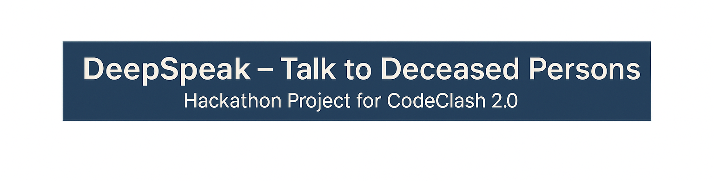
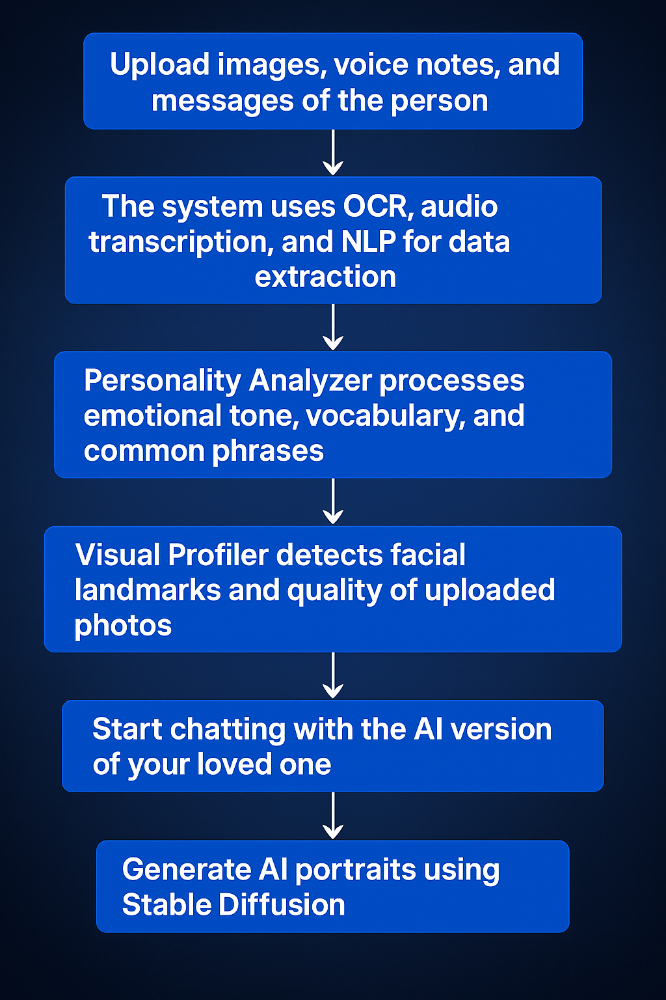

# 💭 DeepSpeak – Talk to Deceased Persons  
### ⚡ Hackathon Project @ CodeClash 2.0

> **Reconnect with memories. Speak to AI personas created from real-life data.**

---

## 🧠 What is DeepSpeak?

**DeepSpeak** is an AI-powered platform that allows users to upload audio, photos, and text related to a deceased person and generates an interactive AI chatbot that speaks and responds like them.

Using advanced **NLP**, **Computer Vision**, and **Generative AI**, it reconstructs communication style, emotional tone, and even generates realistic portraits — helping users preserve memories with empathy and intelligence.

---

## ✨ Key Features

- 📁 Upload text chats, photos, and voice recordings  
- 🎯 Extract personality traits, emotional tones, and linguistic patterns  
- 👤 Reconstruct visual profiles with face detection & AI image generation  
- 🗣️ Chat in real-time with an AI model mimicking the person’s behavior  
- 🧠 Whisper-powered audio transcription  
- 🧾 SQLite database to store chat history and profiles  
- 🖥️ Dual interface: Web UI (Streamlit) + API (FastAPI)  
- 📤 Export profiles for safe storage or future reference

---

## 🧩 How It Works

1. **Upload** images, voice notes, and messages of the person  
2. The system uses OCR, audio transcription, and NLP for data extraction  
3. **Personality Analyzer** processes emotional tone, vocabulary, and common phrases  
4. **Visual Profiler** detects facial landmarks and quality of uploaded photos  
5. A chatbot is initialized using GPT-based models (OpenAI, DeepSeek, or Gemini)  
6. Start chatting with the AI version of your loved one  
7. Generate AI portraits using Stable Diffusion

---

## 🧪 Tech Stack

| Component      | Technology Used                              |
|----------------|-----------------------------------------------|
| Frontend       | Streamlit                                     |
| Backend        | FastAPI + Uvicorn                             |
| NLP & ML       | OpenAI GPT / DeepSeek / Gemini, Transformers  |
| Audio AI       | Whisper by OpenAI                             |
| OCR            | Tesseract OCR                                 |
| Vision         | face_recognition, OpenCV, PIL                 |
| Generation     | Stable Diffusion (via diffusers)              |
| Database       | SQLite (via SQLAlchemy ORM)                   |
| Extra          | scikit-learn, NLTK, torch, dotenv             |

---

## 🧭 Application Navigation

- **Upload & Create** – Upload files and generate AI profile  
- **Chat** – Converse with the AI persona  
- **Profile Viewer** – Review emotional and visual summaries  
- **Generate Images** – Create AI portraits based on name & style  
- **Export Data** – Download `.json` file of profile data

---

## 👥 Team DeepSpeak | CodeClash 2.0

- **Anand Ambastha** –  AI Component | AI/CV/NLP Developer  
- **Naivedya Giri** – Frontend Developer | UI/UX  
- **Krish Tanwar** – Frontend Engineer | UI Optimization  
- **Vasu Chaudhary** – Frontend and Backend Lead | FullStack Developer

---

## 🙏 Special Thanks

- CodeClash 2.0 organizers  
- OpenAI, DeepSeek, Google Gemini, Hugging Face  
- Tesseract OCR, Whisper, and Stable Diffusion communities  

---

> _"We can’t bring them back. But we can remember how they spoke, how they felt — and never let that fade."_
> > _"This README.md is written by the ChatGPT as of now.We will rewrite whole README.md for final round by ourselves"_
